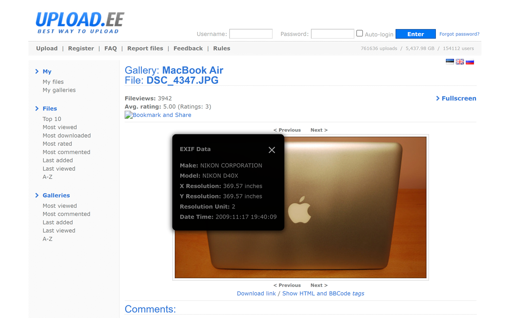

# EXIF Metadata Viewer
Ever wondered about the story behind a photo you see online? The EXIF Metadata Viewer extension lets you instantly reveal the hidden details embedded within images, directly from the context menu in your browser.

All you need to do is right-click on an image to find out if the image has the following details stored:

- Camera settings: Find the make and model of the camera used, along with settings like aperture, shutter speed, and ISO
- Location data: See where the photo was taken (if GPS data is available)
- Date and time: Know exactly when the image was captured.
- And much more: Discover other valuable metadata, such as software used, artist information, and more

It's easy to use: Simply right-click on any image and select "View EXIF Data."
We respect your privacy and don't collect any personal data.

## Installation

### Option 1: Chrome Web Store
Install directly from the Chrome Web Store: [EXIF Metadata Viewer](https://chromewebstore.google.com/detail/exif-metadata-viewer/begcpebobbbopmlfomknjjcfcganemea)

### Option 2: Install as Unpacked Extension
To install as an unpacked extension in Chromium-based browsers (Chrome, Edge, Brave, etc.):

1. Download or clone this repository
2. Open your browser and navigate to the extensions page:
   - Chrome: `chrome://extensions/`
   - Edge: `edge://extensions/`
   - Brave: `brave://extensions/`
3. Enable "Developer mode" using the toggle in the top-right corner
4. Click the "Load unpacked" button
5. Navigate to the downloaded/cloned repository folder and select it
6. The extension should now be installed and ready to use

Test the extension at: https://github.com/ianare/exif-samples

Want to support the project? Use my [Amazon affiliate link](https://amzn.to/4hxcRoi) to do your shopping! It costs you nothing and helps me out.